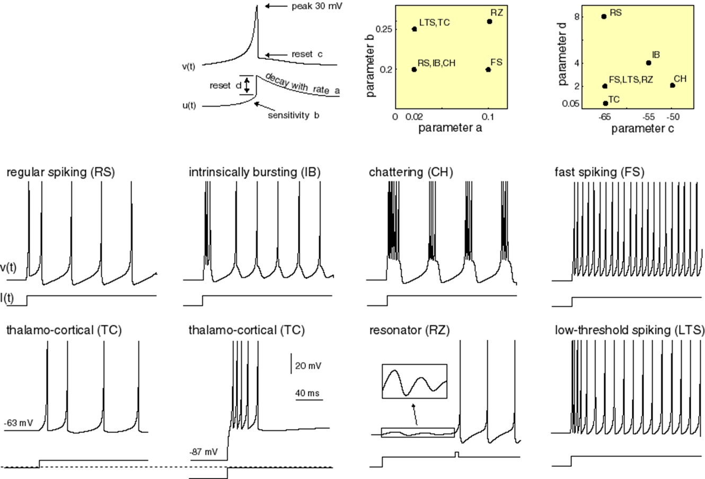

# 大脳ニューロンのイズィケヴィッチモデル (Izhikevich model) の実装
  
# 目的

ニューロン（神経細胞）の活動電位を再現しようという計算モデルは数多くあります。脳には多くの種類のニューロンがあり、すべてのニューロンの発火パターンを正しく記述できる単一のモデルを見つけ出すことは容易ではありません。ニューロンの放電に関する計算論的原則を記述する古典的モデルとしては、ホジキン-ハクスリーモデル([Hodgkin-Huxley model](https://en.wikipedia.org/wiki/Hodgkin%E2%80%93Huxley_model))がありますが、計算量が非常に多くなります。 別の種類のモデルとして、インテグレートアンドファイヤモデル([integrate-and-fire models](https://en.wikipedia.org/wiki/Biological_neuron_model#Perfect_Integrate-and-fire))などは計算が簡単ですが、順応(adaptation)などの重要な神経メカニズムをモデルすることがうまくいきません。計算として実行可能かつ生物学的に妥当(Biologically plausible)なモデルとして、ユージーン・イズィケヴィッチによって提唱された[Izhikevich model proposed by Eugene Izhikevich](http://www.izhikevich.org/publications/spikes.pdf)\hyperref{C0E9F7D1}{[1]}があります。このモデルは、多くの種類のニューロンをモデルでき、発火パターンを推定するために広く使われています。

この[ライブスクリプト](https://jp.mathworks.com/help/matlab/matlab_prog/what-is-a-live-script-or-function.html)はニューロン発火についてのイズィケヴィッチモデルを実装したものです。このモデルはホジキン-ハクスリーモデルのように生物学的に妥当でありながらも、インテグレートアンドファイヤモデルのように計算的に実行可能です。このライブスクリプトでは、ループによる前進オイラー法(forward Euler method)を用いた手計算（数学的な素養がなくても簡単に分かります）に加え、[MATLABに搭載されているodeソルバー](https://jp.mathworks.com/help/matlab/math/choose-an-ode-solver.html)を用いた解法によって、イズィケヴィッチモデルを定義する微分方程式を解きます。２つのアプローチのどちらかをドロップダウンメニューで選択できます。

このライブスクリプトは２つのアプリケーションがついています。１つは[手計算によるオイラー法を用いたもの](http://./IzhikevichApp_Euler.mlapp)で、もう一つは[MATLABに搭載されているodeソルバーを使っています](http://./IzhikevichApp_ode45.mlapp)。MATLABライセンスを持っていない人とこのスクリプトを共有する場合、[前進オイラー法を用いたスタンドアロンアプリケーション](http://./IzhikevichApp_Euler.mlapp)を使ってください。

  
# 1 発火のモデル
## 1.1 イズィケヴィッチの発火モデルの方程式

大脳皮質ニューロンの発火モデルは、ユージーン・イズィケヴィッチによる方程式に基づいています* *\hyperref{C0E9F7D1}{[1]}。モデルの\hyperref{H_B7E5A506}{膜パラメータ (membrane parameters)}を適切に設定することで、多岐にわたる大脳皮質ニューロンをシミュレートすることができます。（下の図を見てください）



*Electronic version of the figure and reproduction permissions are freely available at www.izhikevich.com   *

## 1.2 モデルのパラメータ

イズィケヴィッチモデルは、様々なニューロンの膜の特性を入力パラメータとして使います。このモデルは、刺激を与えられたことで起こるニューロンの興奮をシミュレートしますが、これはニューロンにインジェクションされた電流パルスとしてモデルします。この電流パルスのパラメータ (振幅、期間; amplitude, duration)は、刺激のパラメータとして入力されます。このセクションでは、膜と刺激に関する特性をモデルのパラメータとして定義していきます。

  
### 1.2.1 膜パラメータ

モデルの４つのパラメータである , ,  \&  は、（ニューロンの）膜についての特性を定めるものであり、発火に影響します。

   \item{  = recovery time constant (回復時定数) }
   \item{  = determines whether recovery variable, , is an amplifying ( < 0) or a resonant ( > 0) variable. (回復についてのパラメータが増幅するか共鳴するかを定めるパラメータ) }
   \item{  = voltage reset value following spiking (スパイク発生後の電圧リセットのパラメータ） }
   \item{  = total amount of outward - inward current during spiking (affects after spiking behaviour) (スパイク発生時の外向き-内向きの電流の信号の総量、スパイク発生後のふるまいに影響する） }

さらに、 はスパイクがリセットされた後の電位を表し、  は定数です。

```matlab:Code
% Define membrane parameters...
params.mem.C  = 170;         % membrane capacitance
params.mem.k  = 0.7;
params.mem.vr = -60;        % resting membrane potential
params.mem.vt = -52;         % instantaneous threshold potential
params.mem.a  = 0.09;        % recovery time constant
params.mem.b  = -3.4;        % determines whether u is amplifying (b<0) or resonant(b>0)
params.mem.vpeak = 41;        % spike cutoff
params.mem.c  = -50;        % voltage reset value
params.mem.d  = 170;         % total outward-inward current during spike
```

### 1.2.2 刺激パラメータ

刺激のパラメータは、ニューロンの興奮を引き起こす電流パルスを定義します。

```matlab:Code
% ...and stimulus parameters
params.stm.I          = 70;                         % stimulation amplitude (current)
params.stm.dt         = 0;
params.stm.T          = 1000;                       % total time of stimulation (ms)
params.stm.t          = 1;                          % time step of stimulation (ms)
params.stm.pulseWidth = 0.9;  % width of stimulation pulse (fraction of total time)
params.stm.dt         = params.stm.T*(1 - params.stm.pulseWidth);
```

# 2. 結果

では、以下の２つのどちらかのアプローチを用いて、イズィケヴィッチモデルの微分方程式を解いてみます。

   \item{ 上に示した２つの式を前進オイラー法によるシミュレーションに使います。もしスパイクが発生すれば、膜電位はによって定義された電圧にリセットされ、は更新されます }
   1.  微分方程式をMATLABに搭載されているodeソルバーによって解きます（Symbolic Math Toolboxが必要です) 

前進オイラー法はもっとも単純で早く計算できる方法であるためによく使われています。しかし、ステップサイズを小さくしない限りは正確な解は得られません。その一方、MATLABに入っているodeソルバー（ここで使われているRunge-Kutta 45など）は安定していて妥当な解が得られますが、計算時間がより多く必要になります。積分に異なる方法が用いられているために、それぞれの積分器による解は異なっている可能性があります。イズィケヴィッチモデルに対するソルバーについてより詳しく知りたい場合は[この論文](https://www.researchgate.net/profile/Kevin_Gurney/publication/5874980_Solution_Methods_for_a_New_Class_of_Simple_Model_Neurons/links/02bfe513dff04b1bf4000000/Solution-Methods-for-a-New-Class-of-Simple-Model-Neurons.pdf)を参照してください。

  

イズィケヴィッチモデルのシミュレーションのための積分器を用意します

```matlab:Code
Integrator = 1; % 1: for loop | 2: in-built ode solver
```

## 2.1 方法1: ループによるモデルシミュレーション

```matlab:Code
if Integrator == 1
    % initialize/calculate some parameters
    n = round(params.stm.T/params.stm.t); % simulation time steps
    I = [zeros(1,int32((1-params.stm.pulseWidth)*n)),...
        params.stm.I*ones(1,int32(params.stm.pulseWidth*n))]; % DC current
    v = params.mem.vr*ones(1,n); u = 0*v; % initial values for membrane potential & recovery
    
    % simulate the model
    for ii = 1:n-1
        v(ii+1)=v(ii)+params.stm.t*(params.mem.k*(v(ii)-params.mem.vr)*(v(ii)-params.mem.vt)-u(ii)+I(ii))/params.mem.C;  % membrane potential
        u(ii+1)=u(ii)+params.stm.t*params.mem.a*(params.mem.b*(v(ii)-params.mem.vr)-u(ii));                   % membrane rec variable
        
        % if spike occurs, reset membrane potential and recovery variable
        if v(ii+1)>=params.mem.vpeak
            v(ii)= params.mem.vpeak;
            v(ii+1)=params.mem.c;
            u(ii+1)=u(ii+1)+params.mem.d;
        end
    end
    output = v;
    
    % plot the simulation
    plotIzhikevichSimulation(output,params.stm.t*(1:n),I,params.mem.vr,params.mem.vt)
end
```

## 2.2 方法2 MATLAB odeソルバーの利用 

MATLABのodeソルバーを使うため、[微分方程式をシンボリックに表現](https://www.mathworks.com/help/symbolic/eq.html)しましょう。そのうえで、[ode45ソルバー](https://www.mathworks.com/help/matlab/ref/ode45.html)で微分方程式を解くために、[シンボリックな表現からMATLAB関数への変換](https://www.mathworks.com/help/symbolic/matlabfunction.html)を行います。下にあるイベント関数はイズィケヴィッチモデルのシミュレーションの特殊性に対応するためのものです（訳者注: [不連続性・ゼロクロッシング検出](https://jp.mathworks.com/help/simulink/ug/zero-crossing-detection.html)に対応するものです）。

膜電位がスパイクのカットオフ変数であるを超えたとき、はゼロにリセットされます。このようなイベントやシミュレーションの停止は、\hyperref{663CC79E}{events}によって監視されています。

Symbolic Math Toolboxで式を記述していきます

```matlab:Code
if Integrator == 2
    clearvars -except params Integrator
    syms v(t) u(t) C k vr vt I a b vpeak c d dt Y
    % Define first derivatives for u and v
    DvDt      = diff(v);
    DuDt      = diff(u);
    % Set up differential equations for u and v
    DE_v      = C*DvDt == k*(v - vr)*(v - vt) - u + I*heaviside(t - dt);
    DE_u      =   DuDt == a*(b*(v - vr) - u);
    % Convert the DE to a vector field
    [DE_VF,~] = odeToVectorField(DE_v,DE_u);
```

ここから、シンボリックから数値表現に移行します

```matlab:Code
    % ...and then, convert to a MATLAB function so we can integrate numerically
    DE = matlabFunction(DE_VF,'vars',{t,Y,[C k vr vt a b vpeak c d I dt]});
    % Set the simulation time and initial conditions
    tspan = [0, params.stm.T];
    IC    = [0, params.mem.vr];
    tout  = tspan(1);
    yout  = IC;
    % ...and define the events function. This events function will help us keep
    % track of the resets in the spiking model
    options = odeset('Events',@events);
    
    ie = 1;            % ie == 1 --> detect v >= vpeak, or, v - vpeak >= 0
    while (ie ~= 2)    % ie == 2 --> detect tsim = T, or, tsim - T = 0
        [t,sol,~,~,ie] = ode45(DE,tspan,IC,options,[cell2mat(struct2cell(params.mem))',cell2mat(struct2cell(params.stm))']);
        
        tout  = [tout;   t(2:end)  ]; %#ok<*AGROW>
        yout  = [yout; sol(2:end,:)];
        
        tspan = [tout(end), params.stm.T];             % adjust the simulation time
        IC    = [IC(2) + params.mem.d, params.mem.c];  % and set the values for v and u according to the spiking model
    end
    output = yout(:,2);
    
    % plot the simulation
    figure;
    Iout = zeros(size(tout));
    Iout(tout>=(1-params.stm.pulseWidth)*max(tout))=params.stm.I;
    plotIzhikevichSimulation(output,tout,Iout,params.mem.vr,params.mem.vt)
end
```

# 引用文献

[1]. IEEE Transactions on Neural Networks, 14(6), 2003.

# Appendix

**Events function**はスパイクが発生したときにodeソルバーによって値をリセットするためのものです。積分時にゼロクロッシングを自動的に検出するためにこの関数を使います。2つのイベントを監視する必要があり、１つはモデルそのものがになる部分、によって積分を終了する部分です。

```matlab:Code
function [value,isterminal,direction] = events(t,y,pars)
vpeak      = pars(7);                % Back out the parameters for better readability 
T          = pars(12);
value      = [y(2) - vpeak; T - t];  % And then define the zeros that we need to detected

isterminal = [1;1];   % Stop the integration when zero is detected
direction  = [1;0];   % [Detect only zeros for increasing values; Detect all zeros]
end
```

シミュレーション結果のプロットのための関数

```matlab:Code

function plotIzhikevichSimulation(v,t,I,vr,vt)
% inputs: 
% v = simulated membrane potential
% t = time steps of simulation
% I = stimulation current pulse
% vr = resting membrane potential
% vt = instantaneous threshold potential
%-----------------------------------------------------------------
% plot the results
plot(t,v,'k'); hold on  % plot the membrane potential
cp = plot(t,I,'r');     % plot the stimulus pulse
% show resting membrane potential and spiking threshold on the figure
vrl = line([0 max(t)],[vr vr],'color','b','LineStyle',':','LineWidth',1);
vtl = line([0 max(t)],[vt vt],'color','m','LineStyle',':','LineWidth',1);
% plot aesthetics
ylim([vr-10 max(I)+10])
legend([vtl,vrl,cp],{'spiking threshold','resting potential','DC current'},"Location","northwest")
hold off
xlabel('simulation time (ms)')
ylabel('membrane potential')
end
```

*Copyright 2021 The MathWorks, Inc*

***
*Generated from LiveScript_Izhikevich_jp.mlx with [Live Script to Markdown Converter](https://github.com/roslovets/Live-Script-to-Markdown-Converter)*
